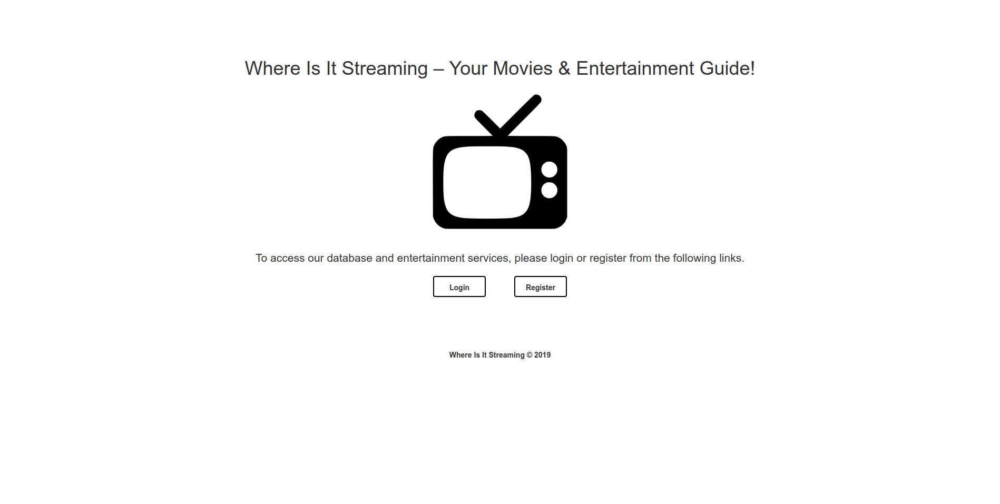
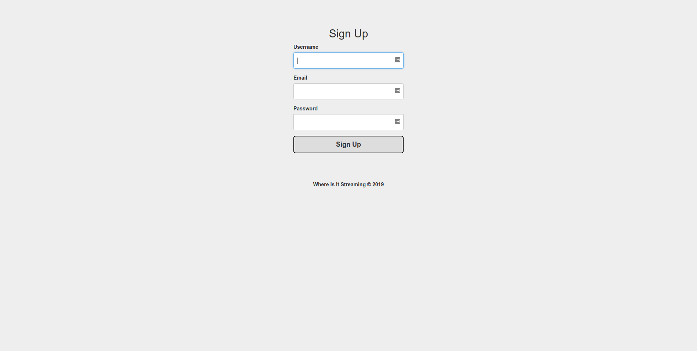
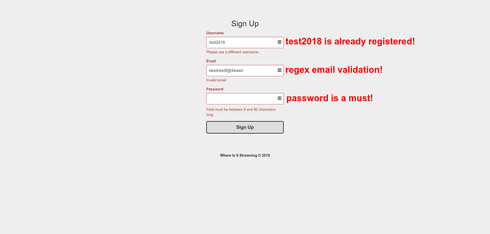
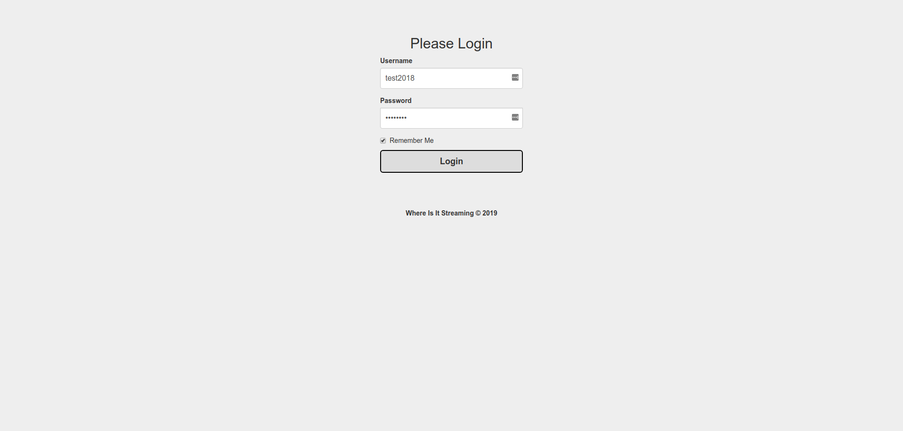
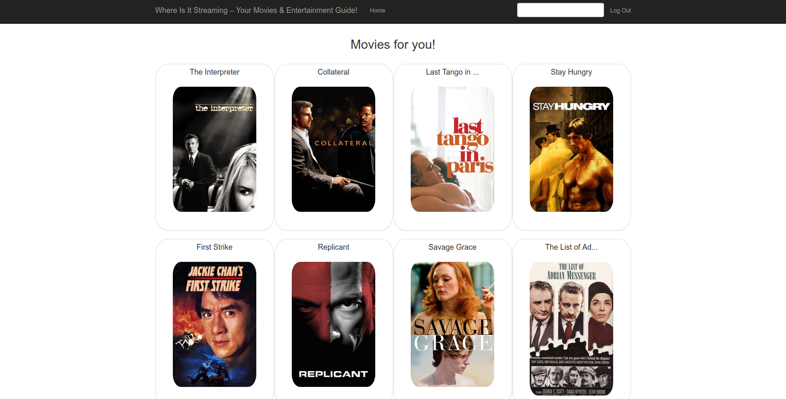
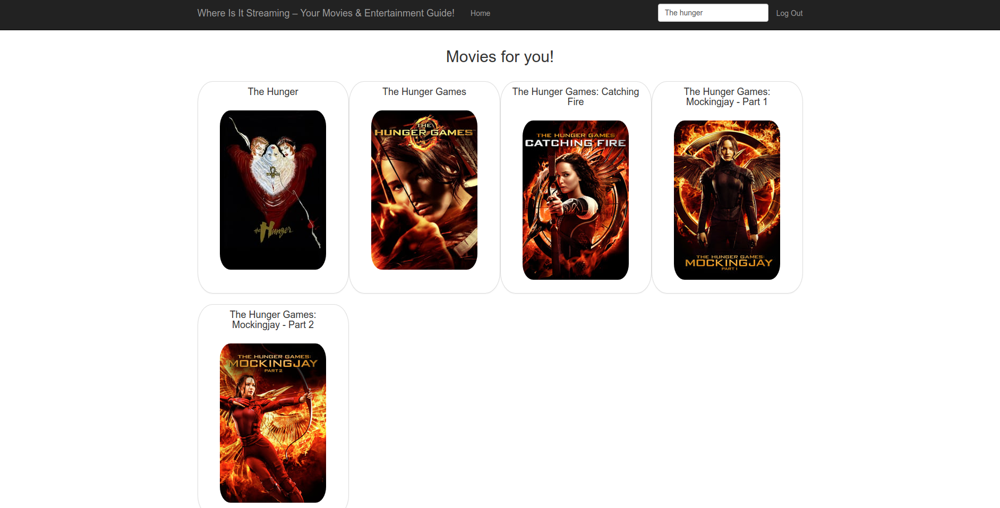

# :computer: Where Is It Streaming :movie_camera:

Where Is It Streaming is the web app that your entertainment has been waiting for. This web app helps you in exploring a wide variety of movies and in finding streaming services, renters, and sellers of your favorite movies. In addition to that, Where Is It Streaming randomly generates twenty movies every time you visit – or refresh – the main page for the convenience of simplifying the struggles of finding a movie to watch :sunglasses:.

## Table of Content :blue_book:	

   * [<g-emoji class="g-emoji" alias="computer" fallback-src="https://github.githubassets.com/images/icons/emoji/unicode/1f4bb.png">💻</g-emoji> Where Is It Streaming <g-emoji class="g-emoji" alias="movie_camera" fallback-src="https://github.githubassets.com/images/icons/emoji/unicode/1f3a5.png">🎥</g-emoji>](#computer-where-is-it-streaming-movie_camera)
      * [Table of Content <g-emoji class="g-emoji" alias="blue_book" fallback-src="https://github.githubassets.com/images/icons/emoji/unicode/1f4d8.png">📘</g-emoji>](#table-of-content-blue_book)
      * [Features <g-emoji class="g-emoji" alias="sparkles" fallback-src="https://github.githubassets.com/images/icons/emoji/unicode/2728.png">✨</g-emoji> <g-emoji class="g-emoji" alias="sunglasses" fallback-src="https://github.githubassets.com/images/icons/emoji/unicode/1f60e.png">😎</g-emoji>](#features-sparkles-sunglasses)
      * [Demo and Screenshots <g-emoji class="g-emoji" alias="camera" fallback-src="https://github.githubassets.com/images/icons/emoji/unicode/1f4f7.png">📷</g-emoji> <g-emoji class="g-emoji" alias="video_camera" fallback-src="https://github.githubassets.com/images/icons/emoji/unicode/1f4f9.png">📹</g-emoji>](#camera-demo-and-screenshots-video_camera)
      * [Usage <g-emoji class="g-emoji" alias="video_game" fallback-src="https://github.githubassets.com/images/icons/emoji/unicode/1f3ae.png">🎮</g-emoji>](#usage-video_game)
        * [Cloning and Virtual Environment](#cloning-and-virtual-environment)
        * [Generating Movies Database](#generating-movies-database)
        * [Running the Web App](#running-the-web-app)
      * [Tools <g-emoji class="g-emoji" alias="eyeglasses" fallback-src="https://github.githubassets.com/images/icons/emoji/unicode/1f453.png">👓</g-emoji>](#tools-eyeglasses)
      * [Current Web App Hierarchy <g-emoji class="g-emoji" alias="muscle" fallback-src="https://github.githubassets.com/images/icons/emoji/unicode/1f4aa.png">💪</g-emoji>](#current-web-app-hierarchy-muscle)
      * [Future Plans <g-emoji class="g-emoji" alias="soon" fallback-src="https://github.githubassets.com/images/icons/emoji/unicode/1f51c.png">🔜</g-emoji>](#future-plans-soon)
      * [Contributing <g-emoji class="g-emoji" alias="fire" fallback-src="https://github.githubassets.com/images/icons/emoji/unicode/1f525.png">🔥</g-emoji>](#contributing-fire)
      * [Collaborators & Contributors <g-emoji class="g-emoji" alias="man_dancing" fallback-src="https://github.githubassets.com/images/icons/emoji/unicode/1f57a.png">🕺</g-emoji> <g-emoji class="g-emoji" alias="dancer" fallback-src="https://github.githubassets.com/images/icons/emoji/unicode/1f483.png">💃</g-emoji>](#man_dancing-collaborators--contributors-dancer)
      * [Inspiration <g-emoji class="g-emoji" alias="notebook" fallback-src="https://github.githubassets.com/images/icons/emoji/unicode/1f4d3.png">📓</g-emoji>](#inspiration-notebook)
      * [License <g-emoji class="g-emoji" alias="books" fallback-src="https://github.githubassets.com/images/icons/emoji/unicode/1f4da.png">📚</g-emoji>](#license-books)

## Features :sparkles: :sunglasses:

Currently, Where Is It Streaming supports the following:

* Registration System
  * Username as Primary Key - No Duplicates
  * Email Regex Validation
  * Hashed Passwords (8 to 80 Characters in Length)
* Login
  * Validation System
  * Users' Sessions
* Searching for Movies
* Movies' Genre, Ratings, Summary, and Casting Preview
* Streaming Services, Sellers, and Renters Locator
* Randomly Generated Movies on Main Page
* Logout

## :camera: Demo and Screenshots :video_camera:

Where Is It Streaming                           | Where Is It Streaming
:-------------------------:|:-------------------------:
   |  
  |  
  |  

## Usage :video_game:

This web app is written in **Python 3** using **Flask** Web Framework. Frontend uses **Bootstrap** Framework. **Sqlite DB** is used - you will need, as instructed below, to build a database from [The Movies Dataset](https://www.kaggle.com/rounakbanik/the-movies-dataset).

### Cloning and Virtual Environment

* `git clone https://github.com/Ahmad-Magdy-Osman/WhereIsItStreaming.git`
* `cd WhereIsItStreaming`
* `python3 -m venv venv`
* `source venv/bin/active`
* `pip3 install -r requirements.txt`

### Generating Movies Database

This step is essential before running the web app.

* Download [The Movies Dataset](https://www.kaggle.com/rounakbanik/the-movies-dataset) and unzip it.
* `mkdir data`
* Move CSV files to the 'data' sub-directory.
* Run `python3 db.py`. Should take a minute or two.

### Running the Web App

* Run the Web App using `python3 app.py`
* Visit [http://127.0.0.1:5000/](http://127.0.0.1:5000/)

## Tools :eyeglasses:

Programming Languages, Frameworks, Libraries, APIs, Databases, and Data Formats.

* Python 3
  * Flask
    * Flask-WTF
    * Flask-User
    * Flask-Images
    * Flask-Bootstrap
    * Flask-StormPath
    * Flask-SqlAlchemy
  * APIs
    * [JustWatch](https://github.com/dawoudt/JustWatchAPI)
  * SQLite3
* SQLite
  * SQL
  * CSV Dataset
* HTML & CSS
  * Bootstrap Framework

## Current Web App Hierarchy :muscle:

* Web Pages
  * Landing Page
    * Pre-login
  * Register
  * Login
  * Main Page
    * Randomly Generated Movies
  * Search
  * Movie Page
  * Logout
    * Leads to Landing Page
* Database Tables
  * Movies - Cast - Crew - Ratings - Users
  * Relationships
    * Many to Many: Movies to Cast
    * Many to Many: Movies to Crew
    * One to Many: Ratings
* More to come...

## Future Plans :soon:

Some of the features that would be appropriate for Where Is It Streaming. Please feel free to pick any of them and start working on improving it as a contributor.

* General
  * Mobile Responsiveness
  * Project Structure and Cleaning
* Features
  * Mark Movies as Watched or To-Watch
  * Like and Unlike Movies
    * Helps with Recommendation System
  * Account Retrieval via Email
* Views
  * View Search History
  * View Liked and Unliked Movies
  * View Watched and To-Watch Movies
* Movie Recommendation System
  * Based on Liked/Unliked Movies
* Content
  * Better Dataset with up-to-date Movies and TV Shows
* Marketing
  * SEO
  * Share on Social Media button
* Style/Design
  * Fonts
  * Footer
  * Movies Images
* Read Me
  * Add Collaborates and Contributors

## Contributing :fire:

1. :spaghetti: Fork this repo!
2. Clone and `cd` into it
3. Setup your virtual environment.
4. Create your feature branch: `git checkout -b my-new-feature`
5. Commit your changes: `git commit -m 'Add some feature'`
6. Push to the branch: `git push origin my-new-feature`
7. Submit a pull request :+1:

## :man_dancing: Collaborators & Contributors :dancer:

[ <b>Ahmad M. Osman</b>](https://github.com/Ahmad-Magdy-Osman) 

## Inspiration :notebook:

> **You will fail.**
> 
> You will mess up.
> 
> You'll do poorly on assignments and tests.
> 
> Your side projects will not work.
> 
> Your code will be sloppy and incomplete.
> 
> You will bomb job interviews.
> 
> Your PR's will be rejected.
> 
> And because you fail, you will succeed.
> 
> Don't be afraid to fail, don't let it destroy your self-confidence, don't let it define you. Instead, do everything you can to learn from that failure and take that new knowledge into the next piece of work.
> 
> Indeed, failure is the only path to success.

        ― Stranger on the Internet.

## License :books:

Where Is It Streaming is an open source project under MIT license.
